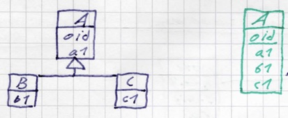
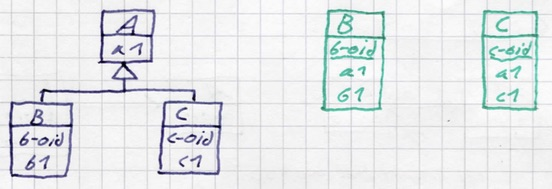
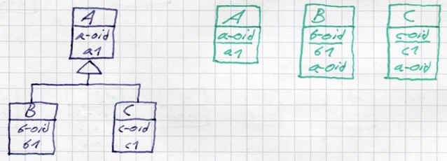

# Enterprise Software Architecture - Prüfungsfragen

## 1. Frameworks, Reflection, Annotationen (BAS)

### Kurzzusammenfassung

- Java EE Anwendungen werden zur Laufzeit in Containern ausgeführt.
- Interaktion zwischen Containern und Anwendungen erfolgt nach dem Prinzip der *Inversion of Control* – dem Architekturprinzip von Frameworks.
- Anwendungsspezifische Komponenten sind zur Entwicklungszeit des Containers unbekannt.
- Instantiierung und Verwendung/Aufruf von Komponenten durch den Container zur Laufzeit erfolgt durch dynamisches Klassenladen, Reflection und evtl. Annotations.

### Prüfungsfragen

#### Reflection

##### 1. Wie können Sie für einen als `String` gegebenen Klassennamen eine Instanz der betreffenden Klasse erzeugen?

```java
// kurze Variante
Object instance = Class.forName("classname").newInstance();

// lange Variante
String classname = "foo";
Class<?> klass = Class.forName(classname);
Object instance = klass.newInstance();
```

##### 2. Welche Voraussetzung muss gegeben sein, damit Sie auf einer gegebenen Instanz von `java.lang.Class` erfolgreich die Methode `newInstance()` aufrufen können?

Die Klasse muss über einen Default-Konstruktor verfügen.

##### 3. Wie können Sie ermitteln, über welche Attribute und Methoden eine gegebene Klasse verfügt?

- Attribute (`java.lang.reflect.Field`)
    - `java.lang.Class.getFields()` - alle öffentlichen Attribute incl. geerbter Attribute
    - `java.lang.Class.getDeclaredFields()` - nur von dieser Klasse selbst deklarierte Attribute
    - `java.lang.Class.getField(String name)`
    - `java.lang.Class.getDeclaredField(String name)`
- Methoden (`java.lang.reflect.Method`)
    - `java.lang.Class.getMethods()` - alle öffentlichen Methoden incl. geerbter Methoden
    - `java.lang.Class.getDeclaredMethods()` - nur von dieser Klasse selbst deklarierte Methoden
    - `java.lang.Class.getMethod(String name)`
    - `java.lang.Class.getDeclaredMethod(String name, Class<>... parameterTypes)`

##### 4. In welcher Form wird Ihnen die Information über die Eigenschaften einer Methode oder eines Attributs einer Klasse durch die Reflection API zur Verfügung gestellt?

- Methode als Instanz von `java.lang.reflect.Field`
    - `Field.getType`...
- Attribut als Instanz von `java.lang.reflect.Method`
    - `Method.getReturnType()`...
    - `Method.getParameterTypes()`...

##### 5. Worin unterscheiden sich die Methoden `getFields()` und `getDeclaredFields()` ?

`getFields()` liefert alle Attribute incl. der geerbten. `getDeclaredFields()` nur die explizit in dieser Klasse deklarierten.

##### 6. Was wird durch eine Instanz der Klasse `java.lang.Class` repräsentiert? Nennen Sie Beispiele.

Alle Member einer Klasse, Bsp:

- Namen aller Instanz- und Klassenattribute und deren Modifikatoren
- Signaturen aller Instanz- und Klassenmethoden und deren Modifikatoren
- alle inneren Klassen
- alle implementierten Interfaces
- alle Superklassen

##### 7. Wie können Sie ermitteln, ob eine durch ein `java.lang.Method` Objekt repräsentierte Methode `public` ist?

***ICH DENKE ER MEINT `java.lang.reflect.Method`. `java.lang.Method` GIBT ES NICHT***

`java.lang.reflect.Modifier.isPublic(Method.getModifiers())`

- `java.lang.reflect.Method.getModifiers()` liefert einen `int` Wert.
    - `java.lang.reflect.Field.getModifiers()` und `java.lang.Class.getModifiers()` ebenfalls
- dieser kann via getestet werden`java.lang.reflect.Modifier.isPublic(int mod)`

##### 8. In welcher Form wird Ihnen die Information über die Modifikatoren einer Methode oder eines Attributs, z.B. deren Sichtbarkeit, zur Verfügung gestellt?

Als `int` Wert.

##### 9. Wie können Sie gezielt, d.h. unter Angabe eines Namens, auf eine Methode oder ein Attribut einer Klasse zugreifen?

`java.lang.Class.getMethod(String name, Class<?>... parameterTypes)` bzw. `java.lang.Class.getField(String name)`
Bei `getMethod` muss noch ein Array aus Klassen übergeben werden, damit die korrekte Methodensignatur gefunden werden kann.

##### 10. Wie können Sie Instanzmethoden auf Objekten aufrufen, deren Klasse Sie zur Implementierungszeit nicht kennen?

`java.lang.reflect.Method.invoke(Object obj, Object... args)` ruft die Methode auf der konkreten Instanz `obj` auf.

##### 11. Wie kann überprüft werden, ob der Datentyp eines Attributs oder ein Rückgabe- oder Argumenttyp einer Methode ein primitiver Datentyp ist?

Durch Abgleich mit der entsprechenden Konstante auf der entsprechenden Wrapper-Klasse. `Field.getType() == java.lang.Boolean.TYPE` ergibt `true`, wenn das entsprechende `Field` vom Type eines primitiven `boolean` ist.

##### 12. Inwiefern gelten für den Zugriff auf Attribute und Methoden mittels Reflection die durch deren Sichtbarkeit ausgedrückten Zugriffsbeschränkungen?

Sie gelten ebenfalls. Der Zugriffsberechtigung kann jedoch via `setAccessible()` geändert werden.

#### Annotationen

##### 1. Wozu können Annotationen, allgemein ausgedrückt, verwendet werden?

Zur Angabe von anwendungsspezifischen Zusatzinformationen bezüglich einer Klasse, eines Interfaces oder ihrer Elemente.

##### 2. Wie werden Annotationen deklariert und wie werden sie verwendet?

```java
public @interface MyAnnotation {
    public Sting param1();
    public int param2();
}
```

Die Verwendung der Annotation erfolgt mittels vorangestelltem `@`, also `@MyAnnotation(param1 = "foo", param2=42)`.

##### 3. Welche Auswirkung hat die Nichtverfügbarkeit eines Annotationstyps auf die Kompilierbarkeit bzw. die Laufzeit-Ladbarkeit einer Klasse?

Nichtverfügbarkeit verhindert das Kompilieren er Klasse. Eine kompilierte Klasse kann jedoch geladen werden, wenn die Annotation nicht zur Laufzeit zur Verfügung steht. Sie werden in dem Fall ignoriert.

##### 4. Sind Annotationen grundsätzlich zur Laufzeit verfügbar?

Nein, nur wenn sie als Geltungsbereich *Runtime-Annotationen* via `@Retention` angegeben haben und zur Laufzeit verfügbar sind.

```java
@Retention(RetentionPolicy.RUNTIME)
@Target(ElementType.FIELD)
public @interface DisplayAs {
    String getValue();
}
```

##### 5. Welche Elemente einer Klasse können mit Annotationen versehen werden?

- die Klasse selbst
- Attribute
- Methoden incl. der Konstruktoren
- Methodenargumente

##### 6. Wie sind Annotationen zur Laufzeit zugänglich

Durch Aufruf von `getAnnotations()` bzw. `getDeclaredAnnotations()` auf dem annotierten Element.
Beispielsweise liefert `java.lang.Class.getAnnotations()` den Rückgabewert `lava.lang.Annotation[]`.
Das Vorhandensein einer bestimmten Annotation kann via `isAnnotationPresent(Class annotationType)` geprüft werden.

##### 7. Welchen Nachteil hat die Verwendung von Annotationen anstelle von Interfaces im Hinblick auf das Laufzeitverhalten einer Anwendung?

Es kann nicht geprüft werden ob alle benötigten Annotationen verwendet wurden. Ebenfalls können die Signaturen von Methoden zur Compilezeit nicht überprüft werden. Das bedeutet das Framework muss ggf. damit umgehen, dass eine Methode nicht bereitgestellt wird.

#### Architektur: Proxies, Frameworks, Komponenten

##### 1. Was ist der wesentliche Unterschied zwischen Proxies und Adaptern als ‘Stellvertretern’ eines Objekts?

Ein Proxy implementiert das gleiche Interface wie sein "Ziel" und verhält sich exakt wie die Zielklasse. Ein Adapter tut dies nicht.

##### 2. Wie kann ein Framework funktional definiert werden?

Ein Framework ist eine *abstrakte und partielle Softwareanwendung* welche zur *Erstellung einer Menge konkreter Softwarekomponenten* eines *bestimmten Typs* dient - z.B. einer Android App mit graphischer Nutzerschnittstelle.

##### 3. Nennen Sie 5 Ausdrucksmittel, mit denen Java die Erstellung von Frameworks unterstützt

- Reflection
- Annotationen
- dynamisches Laden von Klassen
- Abstrakte Klassen
- Interfaces

##### 4. Was sind wesentliche Vor- und Nachteile von Frameworks

- Vorteile
    - Entlastung des Entwicklers, da generische Anwendungsfunktionalität durch das Framework erbracht wird (bspw. Persistenz)
- Nachteile
    - Einschränkung des Handlungsspielraumes, da ein Framework nur für einen bestimmten Anwendungsfall konzipiert ist.

##### 5. Wie lässt sich unter Bezug auf den Begriff des *Frameworks* der Begriff der *Komponente* charakterisieren?

Eine Komponente ist ein *anwendungsspezifisches Implementierungsartefakt* (z.B. eine Klasse), welche

- ihre *anwendungsspezifische Funktion*, sowie
- eine *durch das Framework definierte generische Funktion*

erfüllt. Dazu kann die Komponente bspw. ein durch das Framework definiertes Interface implementieren.

## 2. HTTP und Java EE Web Applikationen (SER)

### Kurzzusammenfassung

- Java EE Web Applikationen
    - eignen sich zur Bereitstellung von Anwendungsfunktionalität
        - über ein GUI auf Basis von server-seitig generiertem HTML Markup (ggf. +CSS, +JavaScript)
        - über eine Web API für ’technische Nutzer’
    - stellen **datenverarbeitende Komponenten** mit unterschiedlichem Aufgabenbereich zur Verfügung
        - `HttpServlet` - *Hauptverarbeitung* von Clientanfragen
        - `Filter` - *"Vorverarbeitung"* von Clientanfragen
        - `JSPs` - *Erwiderungsgenerierung* bezüglich Clientanfragen
        - `Listener` - Reaktionen auf *Lebenszyklusereignisse und Änderungen des Datenbestandes* datentragender Komponenten
    - verwenden **datentragende Komponenten** der Laufzeitumgebung / des Containers mit unterschiedlichem Geltungsbereich / Lebensdauer
        - `ServletContext` - *alle Clients*
        - `HttpSession` - eine *Clientsession*
        - `HttpServletRequest` - eine *Clientanfrage*
-  Wichtigste Komponenten einer Java EE Web Applikation sind Servlets
    - ermöglichen Bearbeitung von HTTP Requests bezüglich einer Menge von URLs
    - erfordern dafür Implementierung einer Bearbeitungsmethode pro verwendeter HTTP Request Methode

### Prüfungsfragen

####  HTTP (Überblick)

##### 1. Wie heißen die Nachrichten, die gemäß der HTTP Spezifikation zwischen Client und Server ausgetauscht werden?

Request und Response.

##### 2. Wozu dient in HTTP eine URI bzw. URL?

Zur Identifikation einer Ressource, auf die mittels eines HTTP Requests zugegriffen werden soll.

##### 3. Was ist neben der URI ein notwendiger Bestandteil eines HTTP Requests und wozu dient dieser?

Die HTTP Methode. Sie gibt an auf welche Art und Weise auf die, per URL spezifizierte, Ressource zugegriffen werden soll.

##### 4. Nennen Sie vier HTTP Methoden.

`GET`, `POST`, `PUT`, `DELETE`

##### 5. Wie soll gemäß HTTP Spezifikation der Erfolg oder Fehlschlag der Bearbeitung eines HTTP Requests durch den Server an den Client übermittelt werden?

Per HTTP Status Code.

- *2xx* - Bearbeitung des Requests erfolgreich
- *3xx* - "Umleitung" des Requests
- *4xx* - Fehler im Request
- *5xx* - serverseitiger Fehler bei der Verarbeitung des Requests

##### 6. Welche Bestandteile können sowohl in einem HTTP Request, als auch in einem HTTP Response enthalten sein?

Header und Body.

#### Web Applikationen

##### 1. Was ist eine Java EE Web Applikation?

Eine Anwendung, die in einem *Web Container / Servlet Container* gemäß Java EE Spezifikation ausführbar ist.

##### 2. Wozu dienen Servlets?

Servlets dienen der *Bearbeitung einer durch den Client an eine Web Applikation übermittelten Anfrage*. Ein `HttpServlet` dient beispielsweise der Verarbeitung von HTTP-Requests.

##### 3. Welche datentragenden Komponenten sieht die Spezifikation für Java EE Web Applikationen vor?

- `ServletContext` - Daten die aus *allen Requests* zugreifbar sein sollen
- `HttpSession` - Daten für alle Requests *einer Session*
- `HttpServletRequest` - Der Request des Client, kann durch datenverarbeitendende Komponenten mit Attributen angereichert werden

##### 4. Was haben Servlets, Filter und Listener gemeinsam?

Es sind *datenverarbeitende Komponenten*, keine datentragenden.

##### 5. Welche Methoden – verallgemeinert ausgedrückt – deklariert die `HttpServlet` Klasse und wozu dienen diese Methoden?

Eine Methode für jede HTTP-Methode, welche zur Verarbeitung eines Requests mit der entsprechenden Methode dient.
Beispielsweise `void doGet(HttpServletRequest req, HttpServletResponse resp)`.

##### 6. Welche Argumente werden den Methoden eines `HttpServlet` übergeben?

- `HttpServletRequest` - der Request vom Client
- `HttpServletResponse` - die Response welche an den Client zurückgesendet werden soll

##### 7. Wie können Filter in Web Applikationen eingesetzt werden?

Zur Vor-/Nachbearbeitung von Requests bzw. Responses vor/nach der Bearbeitung durch eine andere Komponente (z.B. Zugriffskontrolle).

##### 8. Worin unterscheiden sich - entsprechend der Begrifflichkeiten der Lehrveranstaltung - ‘individuell datentragende’ von ‘kollektiv datentragenden’ Komponenten?

- *individuell datentragend:* - pro Nutzer der Komponente eine Instanz (z.B. `HttpSession`)
- *kollektiv datentragend:* - alle Nutzer teilen sich eine gemeinsame Instanz (z.B. `ServletContext`)

##### 9. Wie kommunizieren die Komponenten einer Java EE Web Applikation untereinander?

Die Komponenten kommunizieren nicht direkt miteinander, sondern die Aufrufe werden *durch den Container vermittelt*.
Zur Datenübergabe werden datentragende Komponenten verwendet wie z.B. die Attribute des `HttpServletRequest` oder der `ServletContext`.

##### 10. Was ist die `FilterChain`?

Ein durch den Container bereitgestelltes Objekt, über da ein Filter die Weiterbearbeitung eines Requests durch andere Filter, bzw. durch ein Servlet veranlassen kann. Ist das Ende der FilterChain erreicht, wird das eigentliche Ziel des Requests, z.B. ein Servlet, aufgerufen.

```java
@Override
public void doFilter(ServletRequest request, ServletResponse response,FilterChain chain) throws IOException, ServletException {
	System.err.println("TouchpointWebServiceServletFilter: doFilter() invoked\n");
	// check whether we have a an accept-language header that will be set by the browser but not by the apache http client.
	// otherwise reject the request
	String acceptLanguageHeader = ((HttpServletRequest) request).getHeader("accept-language");
	logger.info("got accept-language header: " + acceptLanguageHeader);
	// we do quite a brute force string match
	if (acceptLanguageHeader == null) {
		chain.doFilter(request, response);
	} else {
		// if we do not find the required header, we block access
		((HttpServletResponse) response).setStatus(HttpServletResponse.SC_FORBIDDEN);
	}
}
```

##### 11. Wie werden die Komponenten von Java EE Web Applikationen konfiguriert?

Durch Einträge in der `web.xml` oder durch Annotationen an den entsprechenden Klassen.

##### 12. Inwiefern können die Ausdrucksmittel für Java EE Web Applikationen als ein Framework zur Entwicklung von Webanwendungen mit server-seitiger Markup-Generierung gemäß dem MVC Architekturmuster aufgefasst werden?

Durch Servlets und JSPs ist eine Möglichkeit zur Trennung von Controller+Model (Servlets) und View (JSP´s) gegeben.
Die Kommunikation zwischen Container und den den anwendungsspezifischen Komponenten (Servlets, Filter, JSP´s) erfolgt weitgehend nach dem "Inversion of Control"-Prinzip.

## 3 REST Web APIs mit JAX-RS (JRS)

### Kurzzusammenfassung
- REST ist ein Architekturstil, der Grundprinzipien für die Gestaltung und Implementierung von Web APIs definiert.
- REST ermöglicht eine größtmögliche Nutzung der Ausdrucksmittel des HTTP Protokolls zur Identifikation der Operationen einer Web API.
- *JAX-RS = Java API for RESTful Web Services*
    - > um die Spezifikation einer Programmierschnittstelle (API) der Programmiersprache Java, die die Verwendung des Software-Architekturstils Representational State Transfer (REST) im Rahmen von Webservices ermöglicht und vereinheitlicht.
- JAX-RS stellt eine Menge von Annotationen zur Verfügung, um für Java Klassen oder Interfaces eine Web API gemäß den Prinzipien von REST zu deklarieren.
- Resteasy ist eine Implementierung von JAX-RS, die die server-seitige Bereitstellung und Ausführung und die client-seitige Verwendung von Web APIs mittels JAX-RS annotierter Interfaces ermöglicht.
- REST ist agnostisch gegenüber dem Repräsentationsformat, in dem Argumente und Rückgabewerte einer Web API übermittelt werden.
- JSON ist ein textuelles Repräsentationsformat, das bei Verwendung geeigneter Anwendungskomponenten auf Client- und Server-Seite – z.B. der Jackson API – auch die Verwendung polymorpher Datentypen erlaubt.

### Prüfungsfragen

#### Java EE Web Applikationen, Frameworks, HTTP (Vertiefung)

##### 1. Inwiefern können die Ausdrucksmittel für Java EE Web Applikationen funktional und architektonisch als Framework angesehen werden?

- **funktional**
    - Java EE stellt eine Reihe abstrakter Komponententypen zur Verfügung, die die Erstellung konkreter Webanwendungen u.a. mit dynamischer Markup-Generierung vereinfachen
- **architektonisch**
    - Die Interaktion des Web Containers mit den anwendungsspezifisch implementierten Komponenten erfolgt nach dem *Inversion of Control*-Prinzip.

##### 2. Was bezeichnet der Begriff der *Idempotenz* im Rahmen der HTTP Spezifikation?

Es besteht kein Unterschied zwischen der mehrmaligen Bearbeitung und der einfachen Bearbeitung eines Requests.

##### 3. Welche HTTP Methode ist nicht als idempotent spezifiziert?

`POST`

##### 4. Inwiefern ist die HTTP `DELETE` Methode idempotent?

Das wiederholte löschen eines Objekts hat die gleiche Auswirkung wie das einmalige Löschen eines Objekts -> Das Objekt ist danach gelöscht.

##### 5. Welche der folgenden Methoden sind keine HTTP Methoden gemäß der gültigen Spezifikation: `POST, READ, UPDATE, DELETE, TRACE`?

`READ` und `UPDATE`

#### HTTP und REST

##### 1. Was sind Web Services?

Web Services sind *Anwendungen*, die *über das Internet* beschrieben und aufgerufen werden können.

##### 2. Welche HTTP Methoden werden in REST Services üblicherweise zur Identifikation der vier CRUD Operationen *Create, Read, Update* und *Delete* verwendet?

| CRUD   | HTTP     |
|:-------|:---------|
| Create | `POST`   |
| Read   | `GET`    |
| Update | `PUT`    |
| Delete | `DELETE` |

##### 3. Was spricht gegen Identifikation einer CRUD Methode durch ein URI Segment, z.B. `/items/7654/?action=update`

HTTP verfügt über Methoden die die vier CRUD Operationen identifizieren können.

##### 4. Inwiefern kann die Ausführung einer Löschoperationen mittels eines Requests wie `GET /items/7654/?action=delete` als fragwürdig erachtet werden?

- HTTP verfügt selbst über eine `DELETE` Methode, diese sollte verwendet werden
- `GET` steht für lesenden Zugriff und wird ggf. auch von Suchmaschinen ausgeführt
- keiner rechnet damit, dass `GET` Daten verändert / löscht.

##### 5. Wie bringen Sie in REST Services üblicherweise die Unterscheidung zwischen einer `readAllItems()` Operation, welche alle Instanzen eines Datentyps ausliest, und einer `readItem()` Operation zum Ausdruck, welche nur eine einzelne – identifizierbare – Instanz ausliest? Für beide Zugriffe soll dieselbe HTTP Methode verwendet werden. Geben Sie ein Beispiel an.

Der Unterschied kann mittels verschiedener URLs ausgedrückt werden.

- `readAllItems()`: `GET http://.../items/`
- `readItem(1234)`: `GET http://.../items/1234` (Zugriff auf item mit der ID 1234)

##### 6. Wie wird in REST Services üblicherweise der Erfolg oder Fehlschlag einer Operation zum Ausdruck gebracht?

Per HTTP Status Code.

- *2xx* - Bearbeitung des Requests erfolgreich
- *3xx* - "Umleitung" des Requests
- *4xx* - Fehler im Request
- *5xx* - serverseitiger Fehler bei der Verarbeitung des Requests

##### 7. Beschreiben Sie (in wenigen Worten) die Grundidee, die einer REST Architektur zugrunde liegt?

Alle Daten die eine Web Anwendung zur Bearbeitung der Anfrage und zur ggf. dafür erforderlichen Identifikation des Interaktionszustands zwischen Client und Server benötigt, werden durch die Anfrage selbst und unabhängig von der zwischen einem bestimmten Client und einem bestimmten Server bestehenden Verbindung bereit gestellt.

##### 8. Was sind die wesentlichen Vorzüge einer REST Architektur?

Hohe Skalierbarkeit und Flexibilität des Servers, da jede Anfrage des Clients von einem neuen Server bearbeitet werden kann (bspw. auch für Load Balancing gut).

##### 9. Welche beiden textuellen Datenrepräsentationsformate werden für die Übermittlung von Instanzen komplexer Datentypen an eine Webanwendung mit REST Service üblicherweise verwendet?

*XML* oder *JSON*

#### JAX-RS und Resteasy

##### 1. Welche beiden Ausdrucksmittel von Java können eingesetzt werden, um eine anwendungsunabhängige Generalisierung des Datenaustauschs zwischen einem Client und einer Webanwendung mit REST Schnittstelle zu implementieren?

Reflection und Annotationen.

##### 2. Wozu dienen die durch die JAX-RS API bereitgestellten Ausdrucksmittel?

- Zur Abbildung von HTTP-Methoden auf Methoden eines Java-Interfaces/Klasse.
- Beschreibung des Übertragungsformates komplexer Datentypen als Argumente und Rückgabedaten via HTTP

##### 3. Welche Funktionalität, die zur Bereitstellung einer Webanwendung mit REST Schnittstelle erforderlich ist, stellt JAX-RS selbst nicht zur Verfügung?

Laufzeitkomponenten, die auf Basis von JAX-RS Annotationen Aufrufe von Java Methoden in HTTP Requests umwandeln und umgekehrt.

##### 4. Umschreiben Sie, wie client- und server-seitig die folgende um JAX-RS Annotationen ergänzte Methodendeklaration interpretiert werden kann:
```java
@DELETE
@Path(‘ /dataitems/{dataItemId}‘ )
public boolean deleteDataItem(@PathParam(‘dataItemId‘) long dataItemId);
```

- *Client*
    - führe bei Aufruf einen HTTP `DELETE` Request auf der URL `.../dataitems/{dataItemId}` aus.
    - `{dataItemId}` entspricht hierbei dem Methodenargument.
- *Server*
    - Wenn ein HTTP `DELETE` Request auf der URL `/dataitems/{dataItemId}` ankommt, dann rufe eine Implementierung der `deleteDataItem` Methode auf und übergebe ihr den Requestparameter `dataItemId` als Attribut vom Typ `long`.

##### 5. Können Sie die Instanzattribute der Implementierungsklasse eines JAX-RS Web Service Interfaces nutzen, um über mehrere Anfragen hinweg Daten zu speichern? Begründen Sie Ihre Antwort.

Nein, JAX-RS erzeugt pro Aufruf einer Methode des Services eine neue Instanz der Klasse (dies entspricht dem REST Prinzip).

##### 6. Wie können Sie ohne Verwendung statischer Attribute oder Implementierung eigener Singletons auf Daten zugreifen, die über mehrere Aufrufe eines JAX-RS Web Services hinweg verfügbar sein sollen?

Durch Dependency Injection mittels der `@Context` Annotation kann ein Zugriff auf die datentragenden Komponenten erhalten werden.

## 4 Web Services mit JAX-WS (JWS)

### Kurzzusammenfassung
- Web Services können nicht nur eine ‘WebAPI’ für den Laufzeitzugriff auf server-seitige Operationen bereit stellen, sondern können hinsichtlich Funktionsumfang, verwendeten Datentypen und Zugriffsform auch maschinenlesbar und implementierungsunabhängig beschrieben werden.
- Die WSDL ist eine Sprache, die eine solche Beschreibung von Web Services ermöglicht.
- Für den Aufruf von mittels WSDL beschriebenen WebServices wird meistens SOAP via HTTP verwendet.
- *JAX-WS = Java API for XML Web Services*
- JAX-WS stellt eine Menge von Annotationen bereit, mit der Java Klassen oder Interfaces als Web Services gemäß der WSDL beschrieben werden können.
- JAXB wird dabei für die Beschreibung des Datenmodells für Argumente und Rückgabewerte verwendet.
- Apache CXF ist eine Implementierung von Compilezeit- und Laufzeitkomponenten für JAX-WS und JAXB und ermöglicht
    - die automatische Generierung von WSDL Beschreibungen auf Basis annotierter Java Komponenten,
    - die automatische Generierung von Java Komponenten auf Basis von WSDL Beschreibungen sowie
    - die Laufzeit-Interaktion zwischen Web Service Clients und den server-seitigen Komponenten, die die Funktionalität des Services implementieren.

### Prüfungsfragen

#### WSDL und XML Schema

##### 1. Wozu dient die WSDL?

Die *Web Service Description Language (WSDL)* dient dazu, die Funktionalität eines Web Services

- vollständig
- implementierungsunabhängig
- programmiersprachenunabhängig
- maschinenlesbar

zu beschreiben.

##### 2. Was wird in einem WSDL Dokument beschrieben?

- Welche *Funktionen / Methoden* werden durch den Web Service zur Verfügung gestellt?
- Welche *Typen von Daten* werden den Operationen übergeben bzw. von diesen zurückgegeben?
- In *welcher Form* kann ein Client auf die verfügbaren Operationen zugreifen?
    - Kommunikationsart, bspw. SOAP
    - Angabe konkreter Adressen

##### 3. Was kann bei Verwendung von JAX-RS die Aufgabe einer WSDL übernehmen? Welche Einschränkung besteht hierbei?

Ein, mit JAX-RS Annotationen annotiertes Java-Interface.
Dieses kann jedoch auch nur von Java-Clients verwendet werden.

##### 4. Was lässt sich mittels XML Schema beschreiben? Welche Ausdrucksmittel stehen hierfür im Einzelnen zur Verfügung?

> Ein Datenmodell auf Basis einfacher Datentypen, komplexer Datentypen Listen und Vererbungsbeziehungen.

XML Schema ist eine *Datenmodellierungssprache*, die in XML Syntax die Deklaration von objektorientierten Datenmodellen u.a. mit den folgenden Ausdrucksmitteln erlaubt:

- *generische* einfache Datentypen (z.B. String, Integer, Boolean)
- *spezifische* einfache Datentypen (Einschränkungen von generischen Datentypen)
- *komplexe* Datentypen
- *Listen* einfacher oder komplexer Datentypen
- *Vererbungsbeziehungen* komplexer Datentypen

##### 5. Wozu wird XML Schema bei der Erstellung eines WSDL Dokuments verwendet?

Zur Deklaration anwendungsspezifischer Datentypen, welche als Argument oder Rückgabewerte von Operationen verwendet werden.

*Kurz: Zur Beschreibung des Datenmodells des Services.*

##### 6. Weshalb ist die automatische Generierung von Java-Komponenten aus einer WSDL Beschreibung mit beliebigen anwendungsspezifischen Datentypen überhaupt möglich?

Weil sich ein XML Schema Datenmodell in ein Java Datenmodell übersetzen lässt.

#### SOAP

##### 1. Wie ist eine SOAP Nachricht aufgebaut?

Eine SOAP Nachricht ist ein XML Dokument.
Es beinhaltet einen *Envelope* und dieser wiederrum einen *Header* und *Body*.

##### 2. Weshalb ist es vorteilhaft, als Transportschicht für SOAP das HTTP Protokoll zu verwenden?

Dadurch kann existierende Web-Infrastruktur (z.B. Firewalls) und -Rahmenfunktionen (z.B. Absicherung über HTTPS) genutzt werden.

##### 3. Weshalb könnte die Verwendung von HTTP als Transportschicht für SOAP als redundanzbehaftet angesehen werden?

HTTP ist ein Anwendungsprotokoll, welches bereits über die Ausdrucksmittel *Header* und *Body* verfügt. SOAP wird im HTTP-Body übertragen und hat ebenfalls einen Header und Body. Dies ist redundant.

#### JAX-WS und JAXB

##### 1. Wozu dienen JAX-WS Annotationen und wofür wird JAXB verwendet?

- *JAX-WS* Annotationen dienen zur Beschreibung von Klassen und Methoden zur automatischen Erzeugung einer WSDL.
- *JAXB* dient zur Beschreibung des Datenmodells, damit daraus ein XML Schema erzeugt werden kann, welches dann in der WSDL verwendet wird.

##### 2. Für welches Ausdrucksmittel in Java ist auf jeden Fall die Verwendung einer JAXB Annotation erforderlich, um eine benutzbare WSDL zu generieren? Welches Defizit weist diese Annotation im Ggs. zur annotierten Javaklasse auf?

Wenn eine Web Service Operation als Argument oder Rückgabetyp *abstrakte Klassen* verwendet, müssen die konrekten Klassen die hierfür auftreten können explizit mittels `@XmlSeeAlso` aufgelistet werden.
Dadurch entsteht eine konkrete Abhängigkeit einer abstrakten Klasse zu ihrer konkreten Unterklasse.

```java
@XmlSeeAlso({org.dieschnittstelle.jee.esa.entities.erp.IndividualisedProductItem.class})
public abstract class AbstractProduct implements Serializable, GenericCRUDEntity {...}
```

##### 3. Wie kann das Problem abstrakter Klassen bei Verwendung von JSON als Datenübertragungsformat für JAX-RS Services gelöst werden? Besteht das oben genannte Defizit auch hier?

Durch die Verwendung von `@JsonTypeInfo`. Das Defizit besteht nicht, da keine Abhängigkeiten zur abstrakten Klasse aufgebaut werden, sondern lediglich im übertragenen JSON die konkrete Klasse spezifiziert wird.

```json
{
    "@class": "org.dieschnittstelle.jee.esa.entities.erp.IndividualisedProductItem",
    "id": 0,
    "name": "Schusterjunge",
    "price": 0,
    "productType": "ROLL",
    "expirationAfterStocked": 720
}
```
##### 4. Beschreiben Sie die beiden Schritte, die durchlaufen werden,um auf Basis JAX-WS/JAXB-annotierter Javaklassen unter Verwendung des JBoss Application Servers einen serverseitigen Web Service und einen diesen Service nutzenden Client bereitzustellen? Wann werden die Schritte ausgeführt (d.h. zur Entwicklungszeit, zum Zeitpunkt des Deployments oder zur Laufzeit)?

- Erstellung einer WSDL und Verfügbarmachung des Services zum Zeitpunkt des *Deployments des Services*
- Generierung und Kompilierung der Client-Komponenten zur *Entwicklungszeit des Clients* und zur *Laufzeit des Services (wegen des Zugriffs auf die generierte WSDL)*

##### 5. Wie ist es möglich, aus einer um JAX-WS Annotationen erweiterten Javaklasse, die Teil einer Java EE Web Applikation ist, auf datentragende Komponenten zuzugreifen, z.B. auf den `ServletContext`?

Eine Web Service Implementierung bekommt Zugriff auf eine Instanz von `WebServiceContext`, indem Sie ein Attribut dieses Typs mit der Annotation `@javax.annotation.Ressource` versieht
Über diese kann dann z.B. auf den `ServletContext` zugegriffen werden.

```java
@Resource
private WebServiceContext wscontext;
ServletContext ctx = (ServletContext) wscontext.getMessageContext()
                            .get(MessageContext.SERVLET_CONTEXT);
```

##### 6. Können in Javaklassen, die mittels JAX-WS als Web Services verfügbar gemacht werden, Instanzattribute verwendet werden, um über Daten über mehrere Aufrufe eines Clients hinweg zu speichern? Begründen Sie Ihre Antwort.

Nein, denn Web Services sind zustandslos.

##### 7. Welchen offensichtlichen Unterschied weisen die auf Basis einer WSDL Beschreibung automatisch generierten Klassen des von einem Service verwendeten Datenmodells im Ggs. zu den originalen Klassen auf?

Sie haben nur einen Default Konstruktor. Alle Attribute müssen per *Setter* gesetzt werden.


## 5 Web Services Vertiefung (WSV)

### Kurzzusammenfassung
- Dynamische Proxies in Java sind zur Laufzeit erzeugte Implementierungen von Interfaces.
- Dynamische Proxies können damit für Interfaces erzeugt werden, die zur Compilezeit unbekannt sind.
- Zur Implementierung eines oder mehrerer Interfaces verwendet ein dynamischer Proxy einen `InvocationHandler`, der die Aufrufe von Interfacemethoden bearbeitet.
- Die Bearbeitung kann z.B. Annotationen auf dem Interface und dessen Methoden ‘interpretieren’ und entsprechend der Funktion des Proxies behandeln.
- Laufzeitausführungskomponenten für JAX-RS und JAX-WS verwenden dynamische Proxies auf Client-Seite für die Umsetzung der Aufrufe von Methoden eines Service-Interfaces als Aufrufe der betreffenden Services via HTTP bzw. HTTP und SOAP.

### Prüfungsfragen

#### Implementierung von Web Service Frameworks

##### 1. Wofür können Sie die `newProxyInstance()` Methode der Klasse `java.lang.reflect.Proxy` verwenden?

Sie erzeugt dynamisch (d.h. zur Laufzeit) eine Instanz einer von `Proxy` abgeleiteten Klasse, die eine Menge an *Interfaces* implementiert.

##### 2. Was braucht eine Instanz von `java.lang.reflect.Proxy`, um die auf ihr aufgerufenen Methoden bearbeiten zu können?

Einen `InvocationHandler`, an dessen `invoke`-Methode die Methodenaufrufe bezüglich dieser Instanz weitergeleitet werden.

##### 3. Was tut eine Implementierung von `java.lang.reflect.InvocationHandler`?

> Processes a method invocation on a proxy instance and returns the result. This method will be invoked on an invocation handler when a method is invoked on a proxy instance that it is associated with.

Sie verarbeitet die Methodenaufrufe an einem `Proxy`-Objekt.

##### 4. Welche Ausdrucksmittel von Java sind besonders hilfreich, um eine Implementierung von `java.lang.reflect.InvocationHandler` zu erstellen?

Reflection und Annotationen.

##### 5. Wozu kann ein Invocation Handler Reflection und Annotations einsetzen?

- *Reflection* - Zur Ermittlung welche Methode auf einem Proxy aufgerufen wurde
- *Annotationen* - Zur Ermittlung wie diese Methode umgesetzt werden soll.

##### 6. Welche Schritte muss in einem JAX-RS Client-Framework ein `InvocationHandler` ausführen, um den Aufruf einer Methode eines JAX-RS annotierten Interfaces zu bearbeiten?

- Ermitteln der *Annotationen* der aufgerufenen Methode
- Anhand der Annotationen die *Methode und URL* eines HttpRequests ermitteln
- ggf. Umwandlung der Argumente (Java-Objekte) ind das gewünschte Repräsentationsformat (z.B. JSON)
- Senden des *Requests an den Server*
- Auslesen des *Response-Body* und ggf. Wandlung der Response-Daten in eine Instanz des Rückgabedatentyps

#### Architekturansätze für Web Services
(individueller Vertiefungsstoff, bis auf weiteres nicht prüfungsrelevant)


## 6 Enterprise Java Beans (EJB)

### Kurzzusammenfassung

- Die Typisierung server-seitiger Komponenten ermöglicht die optimale Nutzung von Speicher- und CPU Ressourcen, um eine möglichst große Anzahl von Clients zuverlässig und effizient bedienen zu können.
- Server-seitige Komponenten können außerdem hinsichtlich ihrer Rolle im Verarbeitungsprozess einer Client-Anfrage unterschieden werden.
- EJBs sind server-seitige Komponenten zur Implementierung der Geschäftslogik- und Datenzugriffsschicht von Anwendungen.
- Erstellung von und Zugriff auf EJBs werden durch den EJB Container verwaltet.
- Lebenszyklusmethoden von EJBs ermöglichen die Reaktion auf ‘Verwaltungstätigkeiten’ des Containers.
- `@Stateless`, `@Stateful` und `@Singleton` EJBs werden als Session Beans bezeichnet. Sie unterscheiden sich hinsichtlich ihrer Lebensdauer und Zugreifbarkeit für einen vs. mehrere Clients über eine Folge von Aufrufen hinweg.
- EJBs können entweder lokal innerhalb einer Laufzeitumgebung über `@Local` Interfaces aufgerufen werden, oder auf mehrere Laufzeitumgebungen verteilt werden und über `@Remote` Interfaces miteinander kommunizieren.
- Der Zugriff auf `@Remote` EJBs ist auf Java Clients eingeschränkt.
- Abhängigkeiten von EJBs zu anderen EJBs werden durch den Container mittels Dependency Injection und Verwendung der `@EJB` Annotation zur Laufzeit bereit gestellt.
- EJB Interfaces kennen den Typ der EJB nicht
    - `@Stateless`, `@Stateful` und `@Singleton` kommt an die Implementierungen (Klassen)
    - `@Local` und `@Remote` an die Interfaces
- EJB´s und ihre "Verwaltungsaktivitäten"
    - `@Stateless` - Pooling
    - `@Stateful` - Passivierung/Reaktivierung
    - `@Singleton` - Locking

### Prüfungsfragen

#### EJBs als server-seitige Komponenten

##### 1. Was ist die Motivation für die Verwendung von komponentenbasierten server-seitigen Architekturen wie EJBs? Erläutern Sie dies mit den Anforderungen an Anwendungen, die in einem Application Server zur Ausführung gebracht werden.

Anwendungsserver müssen eine Vielzahl von (menschlichen oder technischen) Nutzern gleichzeitig performant und zuverlässig bedienen. Das bedeutet dass die verfügbaren Speicher- und CPU-Ressourcen zur Bedienung möglichst vieler Nutzer verwendet werden sollen. Die Ressourcen sollen so verwendet werden, dass sie die Nutzeranfragen möglichst unabhängig voneinander verarbeitet werden sollen. Dies lässt sich durch EJB´s realisieren.

##### 2. Welche Vorteile hat ein Anwendungsentwickler durch die Verwendung von EJBs?

Der Anwendungsentwickler kann sich auf die Implementierung *anwendungsspezifischer Geschäftslogik* konzentrieren, und weitestgehend die Frage ausblenden für wie viele Nutzer die Implementierung zur Verfügung gestellt werden soll.

##### 3. Was muss ein Anwendungsentwickler hinsichtlich einer Verwendung einer anwendungsspezifischen Klasse als EJB beachten?

- Soll die Klasse ein *Datenträger*, *Datenverarbeiter* oder beides sein?
- Wie lange soll die Klasse den Nutzern zur Verfügung stehen? Für eine *einzelne Anfrage* oder eine *Folge von Abfragen*?
- Soll die Klasse nur einem *einzelnen Benutzer* oder *allen Benutzern* zur Verfügung stehen?

##### 4. Welche drei Typen server-seitiger Komponenten lassen sich unterscheiden? Geben Sie Anwendungsbeispiele und nennen Sie die jeweiligen EJB Typen, die für die Umsetzung dieser Komponenten geeignet sind?

- *Individuell datentragende* Komponenten
    - z.B. Warenkorb
    - `@Stateful` EJBs
- *Kollektiv datentragende* Komponenten
    - z.B. Lagerbestand
    - `@Singleton` EJBs
- *Rein datenverarbeitende* Komponenten
    - z.B. Bestellannahme
    - `@Stateless` EJBs

#### Typen von EJBs

##### 1. Wie viele Nutzer können eine `Stateless` EJB gleichzeitig nutzen?

Nur ein Nutzer.

##### 2. Was ist Pooling und was sind seine Vorteile?

Pooling dient der Wiederverwertung von nicht mehr genutzten `Stateless` EJB Instanzen.
Vorteil ist, dass einmal erzeugte Instanzen nicht neu erzeugt werden müssen (geringere Zugriffszeit und weniger Speicherverbrauch als permanente Neuerzeugung bei Zugriff).

##### 3. Für welchen Typ von EJBs wird Pooling angewendet? Weshalb wird es für die anderen Typen nicht eingesetzt?

**Für `Stateless` EJBs**.
Für `Stateful` EJB´s ist es nicht sinnvoll, da diese Daten für einen bestimmten Nutzer beinhalten müssen und immer nur von einem Nutzer verwendet werden.
Von `Singleton` EJB´s existiert eh nur eine Instanz.

##### 4. Was ist Passivierung?

Das Entfernen einer aktuell nicht verwendeten `Stateful` EJB aus dem Arbeitsspeicher und ihre temporäre Persistierung in einem externen Speicher bis zur erneuten Verwendung.

##### 5. Weshalb erfordern `Singleton` EJBs spezielle Maßnahmen im Hinblick auf Concurrency und die anderen EJB Typen keine solche Maßnahmen?

`Singleton` EJB´s sind aus mehreren Threads heraus verwendbar und können somit durch gleichzeitigen Zugriff Inkonsistenzen aufweisen.
`Stateless` und `Stateful` EJB´s sind immer nur aus einem Thread verwendbar.

##### 6. Welche Rolle spielen Annotationen im Hinblick auf die Verwendung von EJBs und welche Rolle kommt der `ejb-jar.xml` Konfigurationsdatei zu?

Alle Merkmale von EJB´s lassen sich mittels Annotationen ausdrücken.
Alle annotierbaren Eigenschaften von EJB´s können alternativ in der Konfigurationsdatei `ejb-jar.xml` überschrieben, und somit zur Laufzeit modifiziert werden.

#### Weitere Konzepte und Ausdrucksmittel für EJBs

##### 1. Was wird (in Bezug auf die Verwendung von Anwendungskomponenten in einer Framework-Architektur) als Lebenszyklus bezeichnet und was sind Lebenszyklusmethoden?

- Der *Lebenszyklus* ist eine *Abfolge von Zuständen*, die eine *Komponente* zur *Laufzeit* durchläuft.
- *Lebenszyklusmethoden* werden durch das Framework aufgerufen, wenn eine *Komponente* durch das Framework *in einen neuen Zustand* gebracht wird / gebracht worden ist.
    - z.B. "Jetzt wurde eine Instanz der Komponente erstellt!" - `@PostConstruct`

##### 2. Nennen Sie drei Beispiele für Annotationen, mit denen Sie Lebenszyklusmethoden in EJBs deklarieren können.

- `@PostConstruct`
- `@PreDestroy`
- `@PrePassivate`
- `@PostActivate`

##### 3. Was sind die wesentlichen Unterschiede zwischen Zugriffen auf EJBs via `@Local` vs. `@Remote` Interfaces im Hinblick auf Argumente und Rückgabewerte?

- Bei `@Local` Interfaces werden die Argumente und Rückgabewerte *by Reference* übergeben.
- Bei `@Remote` Interfaces werden die Argumente und Rückgabewerte *by Value* übergeben.
    - sie werden serialisiert (auch wenn der Zugriff lokal erfolgt)

##### 4. Kann aus Sicht eines EJB Clients die Ausführung einer EJB Methode bei Aufruf über ein `@Remote` Interface Seiteneffekte bezüglich der übergebenen Argumentenwerte haben? Begründen Sie Ihre Antwort.

Nein, da keine Referenz als Argument übergeben wird, sondern eine *by Value* Übergabe eines serialisierten Objekts erfolgt.

##### 5. Welche Ausdrucksmittel stellt Java für die Erstellung und Verwendung von Stubs für EJBs bereit?

Dynamische Proxies (`java.lang.reflect.Proxy`) und InvocationHandler (`java.lang.reflect.InvocationHandler`).

(Ein Stub ist ein Stellvertreter der Komponente der API auf einem entfernten Client. Es ist ein Proxy, welcher die Anfragen weiterleitet.)

##### 6. Wie kann ein EJB Stub die aufgerufene EJB identifizieren?

Anhand ihrer JNDI-URI.

##### 7. Was ist Dependency Injection und welche Vorteile hat dieses Verfahren?

Dependency Injection ist die Bereitstellung von, in einer Komponente benötigten, Komponenten "von außen".
Ich sage dem Framework was ich benötige (z.B. durch eine Annotation an einem Attribut) und das Framework gibt mir eine Instanz davon.
Vorteil ist, dass die Komponente die benötigten Komponenten nicht selbst instanziieren muss, und somit die Implementierung getauscht werden kann (weniger Koppelung).

##### 8. Wer ist bei Verwendung von EJBs zur Laufzeit für die Durchführung von Dependency Injection zuständig?

Das Framework, also der EJB Container.

##### 9. Was muss eine EJB tun, um Dependency Injection zu nutzen?

Ein Attribut mit einem EJB Interface-Typ deklarieren und mit der `@EJB` Annotation versehen.

```java
/*
beanName nur notwendig, wenn mehrere Implementierungen
des OrderSystemLocal-Interfaces existieren
 */
@EJB(beanName="orderSystem")
private OrderSystemLocal orderSystem;
```

##### 10. Welche Konsequenzen hat zur Laufzeit die Verwendung des Werts `javax.ejb.LockType.WRITE` zur Beschreibung Concurrency-Verhaltens einer Methode einer Singleton Bean?

Der Aufruf einer, mit `javax.ejb.LockType.WRITE` annotierten, Methode aus einem Thread führt dazu, dass das Singleton sich für alle anderen Threads sperrt, bis die Methode abgeschlossen wurde.

## 7 Java Persistence Architecture (JPA)

### Kurzzusammenfassung

- Object Relational Mapping (ORM) bezeichnet die Abbildung eines objektorientierten Datenmodells auf ein relationales Datenbankschema und die Abbildung von Objekten auf Datenbankinhalte, bzw. umgekehrt.
- JPA stellt Ausdrucksmittel für die automatische Durchführung von ORM bereit.
- Die Deklaration von Datenbankschemata und der Laufzeitbehandlung von Objekten erfolgt mittels Annotationen auf Javaklassen.
- Zentrales Konzept von JPA ist das Konzept der Entity. Entity Instanzen sind Instanzen eines komplexen Datentyps, welche auf Ebene der von einer Anwendung verwendeten Datenbank einem eindeutig identifizierbaren Datensatz, ggf. inklusive aller assoziierten Datensätze, entsprechen.
- Zur Laufzeit werden Entities mittels eines Entity Managers verwaltet, der durch Implementierungen der JPA bereit gestellt wird.
- Der Entity Manager verwaltet Entities in einem transaktionalen Persistence Context.
- Bei Verwendung von EJBs werden Transaktionen des Entity Managers mit den Zugriffen auf EJB Methoden erstellt bzw. abgeschlossen – falls keine transaktionsbezogenen Einstellungen bezüglich der EJB Methoden vorhanden sind.
- Detached Entities, die außerhalb einer Transaktion erstellt werden, müssen manuell in den Kontext der Transaktion eingeführt werden.
- Die gemeinsam durch einen Entity Manager zu verwaltenden Entities werden durch Persistence Units in der Konfigurationsdatei `persistence.xml` deklariert.

### Prüfungsfragen

#### Datenzugriff, Persistenz und ORM

##### 1. Worin bestehen in einer mehrschichtigen Softwarearchitektur die Aufgaben der Persistenzschicht?

- Implementierung des *Zugriffs auf die zur Datenhaltung verwendeten Anwendungen*
- und ggf. die *Abbildung des von der Geschäftslogik verwendeten Datenmodells* auf das Datenmodell der Datenhaltungsschicht

##### 2. Was ist Object Relational Mapping zur Entwicklungszeit bzw. Laufzeit?

- *Entwicklungszeit*
    - Abbildung des objektorientierten Datenmodells auf ein relationales Datenbankschema oder umgekehrt
- *Laufzeit*
    - Erstellung von Datensätzen in der Datenban auf Grundlage der Instanzen eines OO Datenmodells
    - Instanziierung von Objekten auf Basis ausgelesener Datensätze

##### 3. Was ist der Nachteil bei einer rein manuellen Umsetzung von ORM?

Es ist sehr aufwändig und fehleranfällig.

##### 4. Was sind die Entsprechungen der folgenden objektorientierten Konzepte auf Ebene eines relationalen Datenbankschemas?
- *Klassen* = Tabellen
- *Instanzattribute einfacher Datentypen mit 0..1 Kardinalität* = Tabellenspalten
- *Instanzattribute komplexer Datentypen mit 0..1 Kardinalität* = Fremdschlüssel auf die betreffenden Tabellen
- *Instanzattribute mit 0..* Kardinalität* = Relationstabellen mit Fremdschlüsseln

##### 5. Nennen Sie 4 Fragen, die Sie klären müssen, um auf Basis eines Java Datenmodells ein entsprechendes Datenbankschema zu erstellen.

- Was ist der *eindeutige Identifikator* für Instanzen einer Klasse?
- Was ist die Kardinalität der Assoziation zu Instanzen komplexer Datentypen?
- Handelt es sich bei einer Beziehung zu Instanzen anderer Klassen um eine Aggregations- oder Kompositionsbeziehung?
    - Ist die Existenz der aufeinander bezogenen Instanzen *aneinander gebunden* (Komposition)?
    - oder existieren die Instanzen *unabhängig voneinander* (Aggregation)?
- Wie sollen Instanzen polymorpher Klassen repräsentiert werden?

#### Java Persistence API

##### 1. Welche Arten von Ausdrucksmittel stellt Ihnen die JPA zur Verfügung?

- *Annotationen* zur Abbildung von Java Datenmodellen auf Datenbankschemata
    - (durch Anreicherung der Aussagen des Datenmodells mittels Metadaten)
- Eine *Abfragesprache* (JPA Query Language) zur Formulierung von lesenden und schreibenden Zugriffen auf Datenbankinstanzen unter Verwendung des Java Datenmodells.
- APIs zur Ausführung von lesendem und schreibenden Zugriff auf Datenbestände

##### 2. Was ist Hibernate in Bezug auf die JPA?

Eine Implementierung der JPA Spezifikation.

##### 3. Was sind Entities im Sinne der JPA?

- Java Klassen, die mittels *Annotationen* um Aussagen zur *Realisierung des ORM* erweitert werden
- Entity-Instanzen repräsentieren in Datenbanken *persistierte bzw. zu persistierende* Objekte

##### 4. Warum können kompilierte JPA-Entity-Klassen außerhalb eines Java EE Anwendungsservers als gewöhnliche Java-Klassen verwendet werden?

Weil JPA Annotationen bei Nichtverfügbarkeit der Annotationsklasen zur Laufzeit einfach ignoriert werden.
(Nichtverfügbarkeit von Annotationen verhindert lediglich das Kompilieren einer Klasse.)

##### 5. Was leistet ein `SequenceGenerator` in Bezug auf die Instanzen einer Entity Klasse?

Er erzeugt individuelle Wertfolgen für die Identifikation von Instanzen.

##### 6. Worüber müssen Entity-Klassen (wie andere Klassen, von denen in Java EE dynamisch Instanzen erzeugt werden) verfügen?

Über einen Default-Konstruktor.

##### 7. Welchen Membern einer Entity-Klasse kann die JPA `@Id` Annotation zur Markierung eines einfachen Primärschlüssels zugewiesen werden?

- dem Instanzattribut welches als Primärschlüssel fungieren soll, oder
- einem Getter

##### 8. Mittels welcher 4 JPA Annotationen können Sie die Kardinalität einer Assoziation zum Ausdruck bringen?

- `OneToOne`
- `OneToMany`
- `ManyToOne`
- `ManyToMany`

##### 9. Wozu dient die `@Transient` Annotation der JPA?

Eine `@Transient` Annotation sorgt dafür, dass das entsprechende Attribut nicht auf der Ebene des Datenbankschemas berücksichtigt werden soll.

(Beispielsweise temporäre Werte wie Session IDs...)

##### 10. Welche drei Alternativen bietet Ihnen die JPA zur Behandlung von Polymorphie an?


- Verwendung einer einzigen Tabelle (`SINGLE-TABLE`)
    - 
- Verwendung einer Tabelle pro konkreter Entity-Klasse (`TABLE-PER-CLASS`)
    - 
- Verwendung einer Tabelle pro abstrakter oder konkreter Klasse (`JOINED`)
    - 

##### 11. Nach welchem Kriterium können Sie u.a. entscheiden, welche Alternative für polymorphe Datentypen verwendet werden soll?

Je nachdem ob die Instanzen der Unterklassen oder die Instanzen der Oberklassen häufiger angesprochen werden.
(Häufiges Ansprechen von Oberklasse A = `SINGLE-TABLE`)

#### JPA Laufzeit und Inbetriebnahme

##### 1. Was ist im Rahmen der JPA die Aufgabe eines `EntityManager`?

Der `EntityManager` führt CRUD Operationen auf von ihm verwalteten Objekten als Transaktionen auf der Datenquelle aus.

##### 2. Wann werden die auf einem `EntityManager` aufgerufenen CRUD Operationen in Zugriffe auf die verwendete Datenquelle umgesetzt?

Bei Abschluss der Transaktion, aus der heraus die CRUD Operation aufgerufen wurde.

##### 3. Greifen mehrere parallel ausgeführte Transaktionen auf denselben Zustand eines `PersistenceContext` zu?

Nein, jeder Transaktionskontext verwendet seinen eigenen `PersistencContext`.

##### 4. Was ist eine ‘detached’ Entity?

Eine Entity, welche nicht unter der Verwaltung es `EntityManagers` steht.

##### 5. Welche der vier CRUD Operationen wird durch die `merge()` Methode eines EntityManager bereit gestellt?

Update.

##### 6. Was ist Kaskadierung in Bezug auf die Ausführung einer CRUD Operation?

Kaskadierung in Bezug auf CRUD Operationen bezeichnet die *Ausführung der Operation für die ggf. mit einem Objekt assoziierten Objekte*.

##### 7. Was ist mit Lazy Loading im Rahmen der JPA gemeint?

Bei Lazy Loading werden assoziierte Entities erst geladen wenn der Zugriff auf sie erfolgt und nicht bereits bei der Erzeugung der Instanz.

##### 8. Wann ist Lazy Loading möglich?

Wenn die Entity-Instanz *nicht detached* ist, sich also unter der Kontrolle eines `EntityManagers` befindet.

##### 9. Was ist der offensichtliche Unterschied der JPA QueryLanguage im Vergleich zu SQL?

Anstelle von Tabellennamen und Spaltennamen werden Klassennamen und Attributnamen verwendet.

##### 10. Was ist eine `PersistenceUnit` im Rahmen der JPA?

Eine deklarierte Menge an Klassen, welche durch einen `EntityManager` verwaltet werden sollen.

##### 11. Was ist eine Datenquelle im Sinne der JPA?

Eine Abstraktion über der Datenhaltungsschicht einer Anwendung bzw. eine Menge von Parametern, die für den Aufbau von Verbindungen für den Zugriff auf die Datenhaltungsschicht verwendet werden müssen.

##### 12. Was ist die Aufgabe der `persistence.xml` Konfigurationsdatei im Ggs. zu den `-ds.xml` Konfigurationen?

- `-ds.xml` deklariert Datenquellen
- `persistence.xml` deklariert PersistenceUnits und gibt an, welche Datenquellen dafür verwendet werden sollen.

Alternativ:

`persistence.xml` deklariert diejenige *Menge von Klassen*, die als *Persistence Unit* durch einen `EntityManager` verwaltet werden sollen. In `-ds.xml` werden die Datenquellen deklariert.

## 8 Architekturmuster für EJB und JPA (PAT)

### Kurzzusammenfassung

- Die Session Facade ist ein Entwurfsmuster der Geschäftslogikschicht, das alle für einen Anwendungsfall erforderlichen Teilfunktionen in einem Interface zusammenführt.
- Vorteile der Session Facade sind die Reduzierung von Overhead, der durch Datenübertragung und übertragungsbezogene Datenverarbeitung entsteht, sowie das Verbergen der Umsetzung der Teilfunktionen durch Komponenten unterhalb der Session Facade.
- Session Facades werden bei Verwendung von EJBs als `@Stateful` EJBs realisiert.
- Das Business Delegate ist ein Entwurfsmuster der Präsentationsschicht, bei dem alle für eine Nutzerschnittstelle (bzw. eine Teilfunktion einer Nutzerschnittstelle) erforderlichen Teilfunktionen der Geschäftslogikschicht in einem Interface deklariert werden.
- Bei Realisierung der Präsentationsschicht gemäß MVC gehört das Business Delegate zum Model. Es beschreibt die geschäftslogischen Operationen, die vom Controller verwendet werden können.
- Die Umsetzung des Business Delegate kann den Zugriff auf eine server-seitige Session Facade beinhalten.
- Das Data Access Object (DAO) ist ein Entwurfsmuster der Datenzugriffsschicht, bei dem alle für die Geschäftslogikschicht erforderlichen CRUD Operationen auf Instanzen der Klassen eines Datenmodells jeweils in einem Interface deklariert werden.
- Umgesetzt werden kann ein DAO als `@Stateless` EJB mit JPA `EntityManager`/`@PersistenceContext`.
- Als Argumente und Rückgabewerte von DAOs können in der aktuellen Version von Java EE Instanzen der `@Entity`-Klassen des Datenmodells verwendet werden.

### Prüfungsfragen

#### Session Facade und Business Delegate

##### 1. Was ist Motivation dafür, die Geschäftslogikschicht einer Anwendung um eine Session Facade zu erweitern?

Verhinderung der Mehrfachübertragung von Daten zwischen Client und Server.

> Es soll verhindert werden, dass Daten zur Ausführung von Geschäftsoperationen mehrfach übertragen und übertragungsbezogen verarbeitet werden müssen.

##### 2. Wie wird eine Session Facade in Java EE umgesetzt?

Als `Stateful` *Session Bean*

##### 3. Wie sollte die Session Facade auf die von ihr verwendeten Geschäftslogikkomponenten zugreifen?

Über `@Local` Interfaces und mittels Dependeny Injection.

##### 4. In welchem Zusammenhang stehen Session Facade und Business Delegate?

Business Delegate ist die Entsprechung der Session Facade auf Ebene der Präsentationsschicht.
*(Implementierung auf "Clientseite")*

##### 5. Zu welcher Komponente einer MVC Architektur gehört ein Business Delegate?

zum *Model*

#### DAO und DTO

- *Data Access Object*
- *Data Transfer Object*

##### 1. Was ist die Aufgabe eines DAO?

Abstraktion über lesenden und schreibenden Datenzugriffen für die Geschäftslogigschickt einer Anwendung. *(CustomerCRUD, TouchpointCRUD,...)*

##### 2. Wie werden DAOs aktuell in Java EE realisiert?

Als `@Stateless` EJB´s

##### 3. Wie greift die Geschäftslogikschicht einer Java EE Anwendung auf DAOs zu?

mittels *Dependency Injection*.

##### 4. Was sind DTOs und weshalb sind sie in aktuellen Java EE Anwendungen nicht mehr notwendigerweise erforderlich?

DTOs stellen Daten aus der Datenhaltungsschicht für die Geschäftslogikschicht zur Verfügung.
Werden in aktueller Java EE Implementierung nicht mehr benötigt, da hierfür Entities verwendet werden die serialisierbar und auch außerhalb des Persistenzkontexts verwendet werden können.

##### 5. Weshalb könnte die Verwendung von DTOs auch im Rahmen einer aktuellen Java EE Anwendung in Betracht gezogen werden?

DTO´s ermöglichen die Entkoppelung der Datenhaltungsschicht (hinsichtlich des Datenmodells) von der Geschäftslogikschicht.

## 9 Erweiterte Funktionen für EJB (ADD)

### Kurzzusammenfassung

- EAR Archive sind Bündelungen verschiedener Java EE Module, die gemeinsam in einem Application Server in Betrieb genommen werden und zur Laufzeit einen gemeinsamen Class Loader verwenden.
- JBoss erlaubt außerdem den Export von Klassen eines Java EE Moduls (inkl. EAR) für andere Module, die unabhängig vom exportierenden Modul im Application Server laufen.
- Java EE erlaubt es, das transaktionale Verhalten geschäftslogischer Operationen mittels Annotationen für Bean Managed Transactions bezüglich der Methoden von EJBs zu beschreiben.
- Sollen Transaktionen unabhängig vom Kontext eines Methodenaufrufs gehandhabt werden oder sich auf mehrere Persistence Units oder Datenquellen beziehen, können die Ausdrucksmittel der Java Transaction API (JTA) verwendet werden.
- EJBs können durch JAX-RS oder JAX-WS Annotationen als Web Service bereit gestellt werden.
- Mittels Interzeptor-Klassen für EJBs können methoden- und/oder klassenübergreifende Verhaltensaspekte der Komponenten einer Anwendung ausfaktoriert werden.

### Prüfungsfragen

#### Class Loading und Enterprise Archives

##### 1. Warum können in einem Java EE Anwendungsserver zwei gleichzeitige betriebene Anwendungen verschiedene Versionen derselben Klassen verwenden?

Weil jede Anwendung einen eigenen Classloader benutzt.

##### 2. Wie können in JBoss AS 7.1. Klassen zum gemeinsamen Klassenpfad aller Anwendungen hinzugefügt werden?

Durch einen Export Mechanismus
- in `jboss-deployment-structure.xml` konfiguriert
- exportierte Module können in `MANIFEST.MF` anderer Module als Abhängigkeiten deklariert werden

##### 3. Was ist ein EAR Archiv?

Sammlung von Java EE Modulen zum Zwecke der Ausführung durch einen Applikation Server.
Innerhalb einer EAR Einheit können modulübergreifend Bibliotheken zur Verfügung gestellt werden.

##### 4. Welche Typen von Java EE Modulen kann ein EAR Archiv enthalten?

EJB Module, Web Applikationen und gewöhnliche Java Bibliotheken

##### 5. Für welche Clients eines Anwendungsservers ist es relevant zu wissen, ob EJBs innerhalb eigenständiger Module oder durch Submodule eines EAR bereit gestellt werden, und für welche Clients spielt dies keine Rolle?

*Nur relevant für Clients, welche auf die EJB´s via JNDI zugreifen.* Bei Zugriff via Web Services nicht relevant.

#### Transaktionen

##### 1. Wann erstellt ein Java EE Anwendungsserver eine Transaktion, ohne dass Sie als Entwickler dafür Vorkehrung treffen müssen?

beim Zugriff auf EJB Methoden durch einen EJB Container.

##### 2. Weshalb sind Transaktionen für die Ausführung geschäftslogische Operationen wichtig?

- Gewährleistung der Datenkonsistenz
- Rollback im Fall von Fehlern

##### 3. Wann werden bei Verwendung von transaktionalen EJB Methoden schreibende Zugriffe auf die verwendete Datenquelle durchgeführt?

*NACH* Ausführung der Methode und *VOR* Rückgabe an die aufrufende Methode.

##### 4. Nennen Sie 4 Varianten, wie Entwickler mittels der Verwendung der `@TransactionAttribute` das transaktionale Verhalten von EJB Methoden beeinflussen können?

Beispiel:

```java
@Stateless
public class PointOfSaleCRUDStateless implements PointOfSaleCRUDRemote, PointOfSaleCRUDLocal {
	@PersistenceContext(unitName = "crm_erp_PU")
	private EntityManager em;

	@Override
	@TransactionAttribute(TransactionAttributeType.REQUIRES_NEW)
	public PointOfSale createPointOfSale(PointOfSale pos) {...}
...
}
```

- `REQUIRES` bestehende Transaktion soll verwendet oder neu geschaffen werden falls noch nicht existent
- `REQUIRES_NEW` Transaktion soll neu geschaffen werden
- `MANDATORY` bestehende Transaktion muss vorhanden sein
- `NEVER` es darf keine Transaktion vorliegen

##### 5. Welche Einschränkung besteht bezüglich der Anwendbarkeit der `@TransactionAttribute` Deklaration?

Keine Persistence-Unit übergreifenden Transaktionen.

##### 6. Was muss bei der Verwendung einer transaktional als `RequiresNew` gekennzeichneten Methode beachtet werden?

Falls außerhalb der Methode Fehler auftreten, müssen Änderungen die durch diese Methode vorgenommen wurden, evtl. manuell rückgängig gemacht werden.

#### EJBs und Web Services

##### 1. Was ist erforderlich, um die Methoden einer EJB Implementierung direkt als Operationen eines JAX-WS Web Service verfügbar zu machen?

- Deklaration eines EJB Interfaces als `WebService`
- Deklaration des Interfaces als `endpointInterface` in der EJB

##### 2. Können EJBs in JBoss als Web Service via JAX-RS bereit gestellt werden?

Ja.

##### 3. Können Stateful EJBs als JAX-WS oder JAX-RS Web Services bereit gestellt werden? Motivieren Sie ihre Antwort.

Nein, weil die genannten Web Services an sich zustandslos sind.

#### Interzeptoren

##### 1. Was sind Interzeptoren?

Anwendungskomponenten, welche in die unmittelbare Kommunikation zwischen zwei Komponenten "eingehangen" werden können.

##### 2. Was sind, verallgemeinert ausgedrückt, Funktionen, die durch Interzeptoren umgesetzt werden?

- Vor-, Nachverarbeitung von Daten
- Cross-Cutting-Concerns
    - Allgemeine Funktionalitäten

##### 3. Nennen Sie drei konkrete Beispiele für Funktionen, die üblicherweise durch Interzeptoren umgesetzt werden können.

- Logging
- Profiling (Zeitmessung)
- Authentifizierung

##### 4. Wie können Sie in Java EE Interzeptoren auf die Eigenschaften des zu bearbeitenden Methodenaufrufs zugreifen?

Mittels eines `InvocationContext` Objekts, das den Aufruf repräsentiert. Dieses enthält:

- die aufgerufene Methode als `Method` Objekt
- die Übergebenden Argumentwerte als `Array`

##### 5. Welche Komponenten von Java EE Web Applikationen werden üblicherweise als Interzeptoren verwendet?

Filter.

## 10 Java Server Faces (JSF)

### Kurzzusammenfassung

- JSF ist eine Spezifikation zur Umsetzung der Präsentationsschicht von Java EE Anwendungen gemäß dem MVC Architekturmuster.
- JSF Views basieren auf einer Menge abstrakter Bedienelemente (‘UI Komponenten’)), die u.a. als HTML Elemente realisiert werden können.
- JSF sieht server-seitig eine Repräsentation von Ansichten als Baum von UI Komponenten vor, die in der gewählten Realisierungsform an die den Client ausgeliefert werden, z.B. als HTML Markup.
- Übermittelt der Client einen Request, erfolgt vor Bearbeitung zunächst eine Wiederherstellung des Komponentenbaums.
- Grundlage dafür ist eine Beschreibung der statischen und dynamischen Bestandteile einer Ansicht mittels Facelets.
- Im Anschluss an die server-seitige Wiederherstellung der Ansicht wendet die JSF Laufzeitausführung einen wohldefinierten Verarbeitungszyklus an, der u.a. die Validierung der eingegebenen Werte vorsieht.
- Der Verarbeitungszyklus selbst kann als generische Umsetzung partieller Controller-Funktionalität gemäß MVC angesehen werden.
- Aus dem Verarbeitungszyklus heraus können anwendungsspezifische Controller-Komponenten aufgerufen werden.
- Controller werden in JSF als `ManagedBeans` umgesetzt.
- Aus `ManagedBeans` heraus können andere `ManagedBeans` und/oder EJBs aufgerufen werden, die die Model-Schicht der MVC Architektur darstellen.
- JSF verfügt über verschiedene Ausdrucksmittel für das *Binding* von Inhalten und Funktionalität von `ManagedBeans` an die View-Komponenten einer Anwendung.

### Prüfungsfragen

#### Allgemeines
##### 1. Auf welcher Ebene einer Mehrschichtenarchitektur ist die Verwendung von JSF angesiedelt?
##### 2. Welches Architekturprinzip liegt den Konzepten von JSF zugrunde?
##### 3. Nennen Sie zwei Ausdrucksmittel von JSF, die Sie zur Umsetzung der Controller bzw. View Komponenten im Rahmen einer MVC Architektur einsetzen können.

#### JSF und HTML
##### 1. In welchem Verhältnis stehen die von JSF bereit gestellten UI Komponententypen zu den Ausdrucksmitteln von HTML?
##### 2. Welche beiden Repräsentationen einer GUI Ansicht werden durch JSF miteinander ‘synchronisiert’ und wo werden diese Repräsentationen verwendet?
##### 3. Wann wird in JSF die Synchronisierung von DOM und UI Komponentenbaum durchgeführt?

#### Managed Beans
##### 1. Welche vier Geltungsbereiche / Scopes kann eine Managed Bean haben?
##### 2. Welcher der vier Scopes von Managed Beans ist spezifisch für JSF und ist nicht bereits für Java EE Web Applikationen vorgesehen? Was ist in diesem Scope enthalten?
##### 3. Bestehen bezüglich des Zugriffs auf Managed Beans unterschiedlicher Scopes in JSF vergleichbare Einschränkungen wie zwischen verschiedenen Typen von EJBs?
##### 4. Welchem Scope muss eine JSF Managed Bean angehören, wenn in ihr eine Stateful EJB verwendet werden soll?

#### JSF und MVC
##### 1. Nennen Sie drei Beispiele für das deklarative Binding von View Komponenten in Facelets an Managed Beans als Controller in JSF.
##### 2. Welche Ausdrucksmittel werden für deklaratives Binding in Facelets genutzt?
##### 3. Wie wird bei der Auswertung einer Expression, z.B. `#{bean.property}` auf den durch `property` bezeichneten Wert zugegriffen?
##### 4. Wann werden Listener und Validatoren auf Bedienelementen eines mit JSF aufgebauten Formulars ausgeführt, wenn die Ajax Funktionen von JSF nicht genutzt werden?
##### 5. Wann werden im JSF Verarbeitungszyklus die vom Nutzer in ein Formular eingegebenen Werte in die damit assoziierten Managed Bean Properties übertragen?
##### 6. Welche drei Möglichkeiten stellt JSF zur Verfügung, um die Folgeansicht einer gegebenen Ansicht zu bestimmen, die dem Nutzer nach (erfolgreicher) Ausführung einer Aktion angezeigt werden soll?
